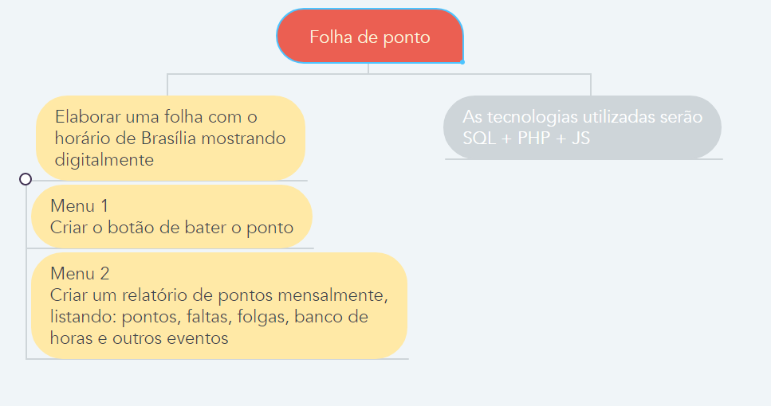

## O projeto - Folha de ponto WEB

## Definição 
#**A elaboração desse projeto "Folha de ponto WEB" foi um desafio que o [Café Codes - Adelson](https://www.twitch.tv/cafecodes) me propôs à realizar como atividade de aprendizado.**

**Tecnologias utilizadas**
- [x] HTML & CSS
- [x] PHP
- [x] JS
- [x] SQL
- [x] Bootstrap 3

**BETA 1.0**
- [x] Criar a página principal
- [x] Automatizar a data & hora
- [ ] Elaborações de MENU (Menu1: Bater o ponto | Menu2: Relatório de pontos)
- [ ] Elaboração do banco pelo SQL

